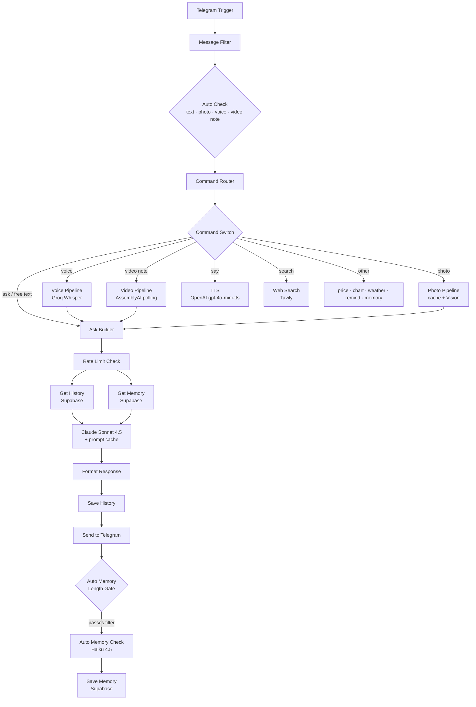

# Architecture

Askeladd runs as **five coordinated n8n workflows** backed by a single Postgres (Supabase) database. The Main Bot handles every inbound message; the other four run on schedules.

## Main Bot — request pipeline

Every modality (text, photo, voice, video note) is normalized into the same `question` + optional image payload and converges on a **single reasoning path** (`Ask Builder → Claude → Save → Send`). That convergence is what keeps a five-input bot maintainable instead of five parallel forks.

## The five workflows

**WF1 — Morning Digest.** Scheduled. Pulls weather, builds a prompt, generates a short morning brief and sends it.

**WF2 — Main Bot.** The pipeline above. Trigger → filter → modality routing → reasoning → persistence → memory classification.

**WF3 — Market Cache.** Hourly. Fetches BTC dominance and caches it so user-facing commands read from cache instead of hitting the API on every call.

**WF4 — Reminders.** One-minute poll. Checks due reminders, sends them, deletes the row.

**WF5 — Memory Consolidation.** Weekly. Selects users whose stored-fact count exceeds a threshold, has Haiku collapse semantic duplicates, validates the result, then swaps old facts for the consolidated set. Keeps long-term memory small and cheap.

## The reasoning request

The Main Bot assembles each Claude request from:

- A **two-block system prompt** — a large static persona/rules block marked for caching, plus a small dynamic block (current memory facts, local time, photo context).
- **Conversation history** — the last several turns, fetched newest-first, capped per message and per count.
- The **current question**, optionally carrying base64 image blocks for Vision.

See [`snippets/`](../snippets/) for the actual builder logic and request body, and [`ENGINEERING_NOTES.md`](ENGINEERING_NOTES.md) for the production decisions behind them.

## Data layer

A single Postgres database (Supabase) holds long-term memory, conversation history, a generic cache, rate-limit state, reminders, a photo cache and photo telemetry. `pg_cron` prunes the volatile tables daily. Schema and maintenance jobs are in [`sql/`](../sql/).
